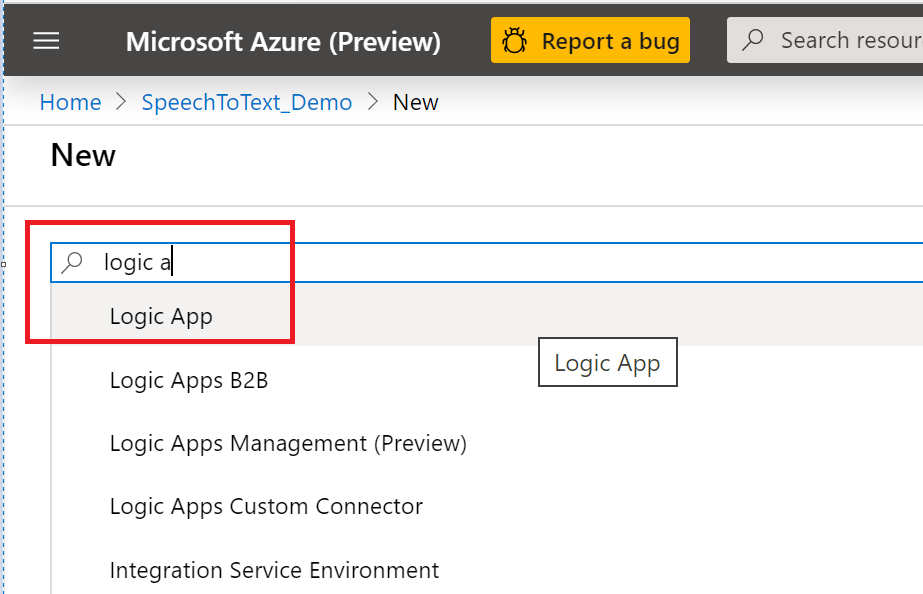
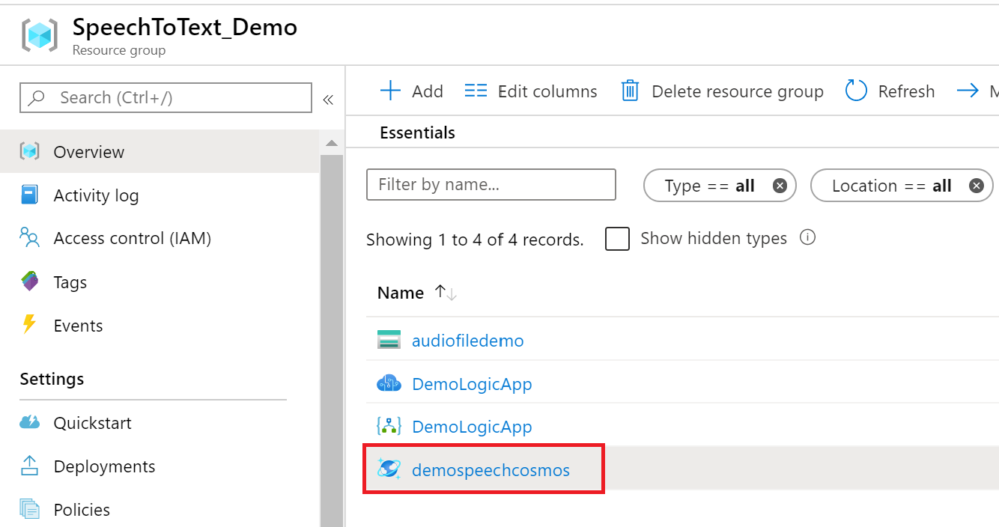
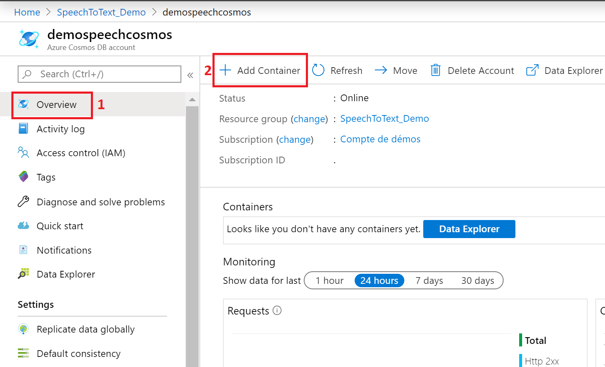
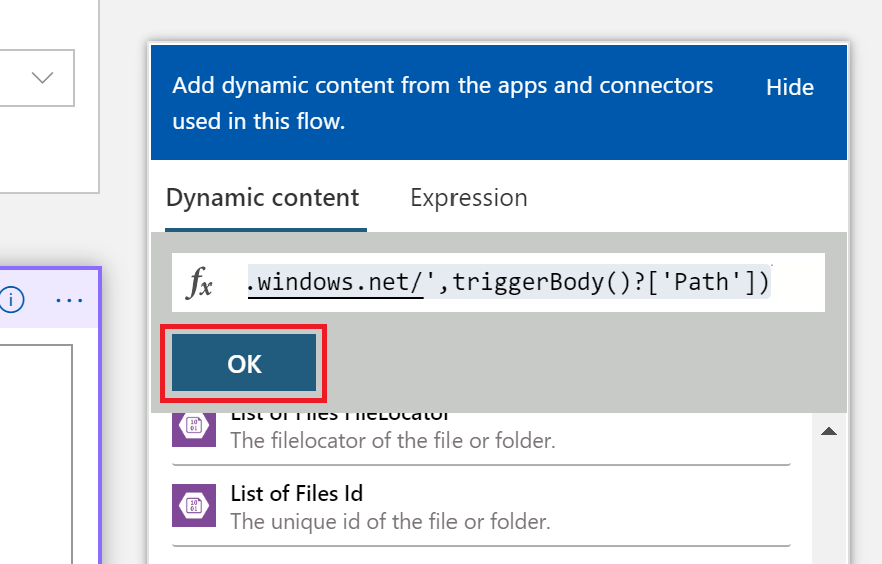

Dans cet article, je vais détailler les étapes pour transformer une discussion enregistrée dans un fichier audio en texte, enrichir cette transcription avec des analyses de sentiments, puis terminer par une représentation de cette discussion dans un rapport Power BI afin d'en faire une analyse.

Pour ce faire nous allons utiliser plusieurs services de la plateforme Azure dont principalement :

- Un compte de stockage Azure
- Le service cognitif "Speech to text"
- Azure Logic App
- Azure Cosmos DB

## Prerequis

- Un abonnement Azure

# Création des services Azure
## Création d'un groupe de ressources
Nous allons commencer par créer un groupe de ressouces afin d'héberger les différents services de notre solution de transcription de fichiers audio.

Depuis le portail [Azure](https://portal.azure.com), cliquez sur "Create a resource"


 Puis, recherchez "Resource group"

 


Cliquez sur le bouton "Create"


Dans le champ "**Resource group**", donnez un nom à votre groupe de ressources. Cliquez sur le bouton "**Review + Create**"


Dans l'écran de validation, cliquez sur le bouton "**Create**"


Revenez à l'accueil du portail Azure. Cliquez sur le menu burger en haut à gauche puis sur "**Resource** **groups**"


Cliquez sur le groupe de ressources créé précédement


## Création du compte de stockage

Une fois dans le groupe de ressources, cliquez sur le bouton "**Add**" 


Recherchez le compte de stockage


Cliquez sur le bouton "Create"


Complétez la création du compte de stockage et cliquez sur "**Review** + **create**"


Après avoir vérifié les informations de création du compte de stockage, cliquz sur le bouton "Create"


## Creation du service Azure Logic App
Dans le groupe de ressources précedement créé, cliquez sur le bouton "**Add**"


Puis recherchez "**Logic App**"



Cliquez sur le bouton "**Create**"


Complétez l'étape de création du service "Logic App", puis cliquez sur "**Review + create**"


Dans la fenêtre de validation, cliquz sur le bouton "**Create**"


## Création du service cognitif "Speech to text"
Dans le groupe de ressources précedement créé, cliquez sur le bouton "**Add**"


Recherchez le service "**Speech**"


Cliquez sur le bouton "Create"


Complétez le formulaire de création, puis cliquez sur le bouton "**Create**"


## Création du service Azure Cosmos DB

Dans le groupe de ressources précedement créé, cliquez sur le bouton "**Add**"


Recherchez "**Azure Cosmos DB**"


Cliquez sur le bouton "**Create**"


Remplissez le formulaire de dréation du service. Choisissez l'API "**Core (SQL)**".
Cliquez sur le bouton "**Review + create**"


Après avoir validé les informations, cliquez sur le bouton "**Create**"


# Préparation des services
## Compte de stockage
Nous allons maintenant créer un container afin de recevoir les fichiers audio

Depuis votre groupe de ressources, cliquez sur le service de compte de stockage


Cliquez sur "**Containers**"


Cliquez ensuite sur le bouton "**+ Container**". Donnez un nom à votre container puis cliquez sur le bouton "**Ok**".


Le nouveau container doit apparaître dans la liste comme illustré ci-dessous


## Création d'une collection Azure Cosmos DB

Nous allons maintenant créer une collection afin de recevoir la transciption au format texte du fichier audio

Depuis votre groupe de ressources, cliquez sur le service Azure Cosmos DB



Vérifiez de bien être dans la partie "**Overview**" du service, puis cliquez sur "**+ Add Container**"



Dans la section "Add Container", sélectionnez "Create new" pour créer une nouvelle base. Pour cet article, nous allons choisir "**Manual**" pour les "Throughput" et définir la valeur à **400**.

Enfin, donnez un nom à votre collection et choisissez une clef de partionnement. Ici je choisis comme clef la date, car concernant mom projet, on aura de nombreux fichiers par jour et il faudra faire des rapports sur une plage detemps vairant de la semaine au mois.


Après la création du container vous devriez obtenir un résultat similaire à la copie d'écran ci-dessous :


## Configuration du service Azure Logic Apps

Pour transcrire les fichiers audio qui seront déposés dans le compte de stockage, nous allons utiliser l'API REST de transcription par lot :

https://docs.microsoft.com/fr-fr/azure/cognitive-services/speech-service/batch-transcription

Les étapes ci-dessous vont permettre de configurer le service Azure Logic App pour appeler l'API REST du servive cognitif "Speech" dès qu'un fichier audio arrivera dans le container.

Depuis votre groupe de ressources, cliquez sur le service Azure Logic Apps


Cliquez ensuite sur "Blank Logic App"


Vous allez 6etre ensuite redirigez vers l'éditeur d'Azure Logic Apps


Dans la zone de recherche, entrez "**Blob**", puis sélectionnez "**When a blob is added or modified**"


Donnez un nom à votre chaine de connexion puis sélectionnez le compte de stockage créer au début de cet article


Dans le champ "**Container**", cliquez sur l'icône à droite (1) et sélectionnez le container créé précédement dans cet article. Définissez 5 secondes d'intervale entre chaque vérification de la présence de nouveaux fichiers dans le container
 


Cliquez sur "**+ New step**" afin de créer une action supplémentaire


Dans la zone de recherche, entrez le mot "JSON" puis cliquez sur "Data Operations"


Sélectionnez "**Compose**"


Dans le champ input, entrez la partie JSON ci-dessous, sachant que nous allons ensuite compléter la partie en rouge


```javascript
{
  "description": "La description est optionnelle",
  "locale": "en-US",
  "name": "transcription-batch",
  "properties": {
    "AddSentiment": "True",
    "AddWordLevelTimestamps": "True",
    "ProfanityFilterMode": "Masked",
    "PunctuationMode": "DictatedAndAutomatic"
  },
  "recordingsUrl": 
}
```


Cliquez à droite de "recordingUrl" afin de faire apparaître la fenêtre du contenu dynamique. Cliquez sur Expression puis sur la fonction "**concat**" 


Dans la première partie de la concatenation, entrez l'adresse de votre compte de stockage. Cette adresse peut se retrouver dans les propriétés de votre compte de stockage. **N'oubliez pas les quotes pour entrer l'adresse : 'https://audiofiledemo.blob.core......'**
 


Ce qui va donner la première partie de notre concatenation :


Rajoutez une virgule à la fin du texte. Nous allons rajouter la partie spécifique au container et au fichier en récupérant l'information de l'étape précédente. Cliquez sur "**Dynamic Content**" puis sur "**List of Files Path**"


Puis cliquez sur le bouton "**OK**"



Voius devez donc obtenir quelque chose de similaire à la copie d'écran ci-dessous :


Et le script de la fonction de concatenation doit ressembler à celui ci-dessous :

```javascript
concat('https://audiofiledemo.blob.core.windows.net/',triggerBody()?['Path'])

```