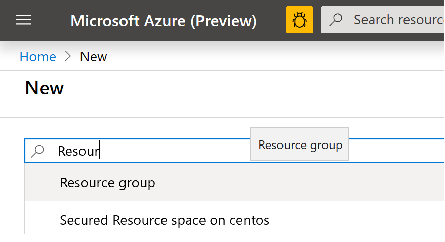
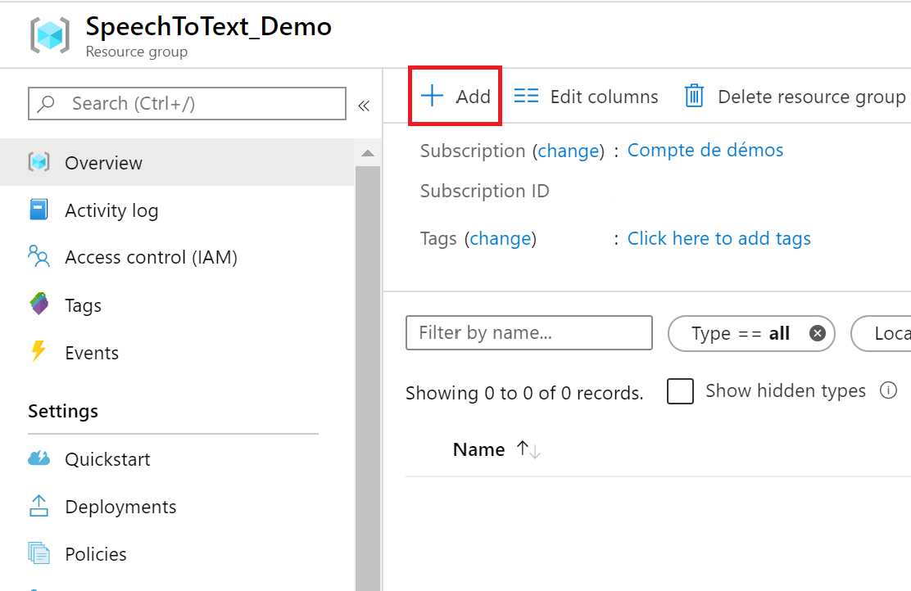

Dans cet article, je vais détailler les étapes pour transformer une discussion enregistrée dans un fichier audio en texte, enrichir cette transcription avec des analyses de sentiments, puis terminer par une représentation de cette discussion dans un rapport Power BI afin d'en faire une analyse.

Pour ce faire nous allons utiliser plusieurs services de la plateforme Azure dont principalement :

- Un compte de stockage Azure
- Le service cognitif "Speech to text"
- Azure Logic App
- Azure Cosmos DB

## Prerequis

- un abonnement Azure

# Création des services Azure
## Création d'un groupe de ressources
Nous allons commencer par créer un groupe de ressouces afin d'héberger les différents services de notre solution de transcription de fichiers audio.

Depuis le portail [Azure](https://portal.azure.com), cliquez sur "Create a resource"

 Puis, recherchez "Resource group"

 

Cliquez sur le bouton "Create"

Dans le champ "**Resource group**", donnez un nom à votre groupe de ressources. Cliquez sur le bouton "**Review + Create**"

Dans l'écran de validation, cliquez sur le bouton "**Create**"

Revenez à l'accueil du portail Azure. Cliquez sur le menu burger en haut à gauche puis sur "**Resource** **groups**"

Cliquez sur le groupe de ressources créé précédement

## Création du compte de stockage

Une fois dans le groupe de ressources, cliquez sur le bouton "**Add**" 

Recherchez le compte de stockage

Cliquez sur le bouton "Create"

Complétez la création du compte de stockage et cliquez sur "**Review** + **create**"

Après avoir vérifier les informations de création du compte de stockage, cliquz sur le bouton "Create"

## Creation du service Azure Logic App
Dans le groupe de ressources précedement créé, cliquez sur le bouton "**Add**"

Puis recherchez "**Logic App**"

Cliquez sur le bouton "**Create**"

Complétez l'étape de création du service "Logic App", puis cliquez sur "**Review + create**"

Dans la fenêtre de validation, cliquz sur le bouton "**Create**"

## Création du service cognitif "Speech to text"
Dans le groupe de ressources précedement créé, cliquez sur le bouton "**Add**"

Recherchez le service "**Speech**"

